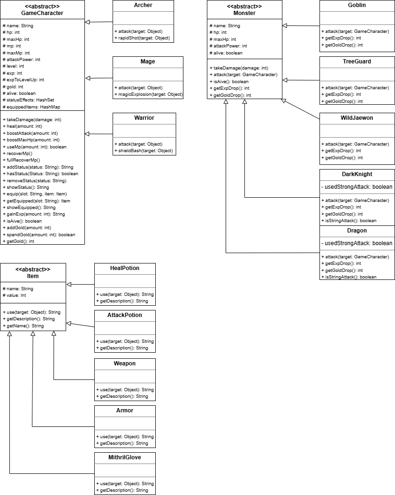
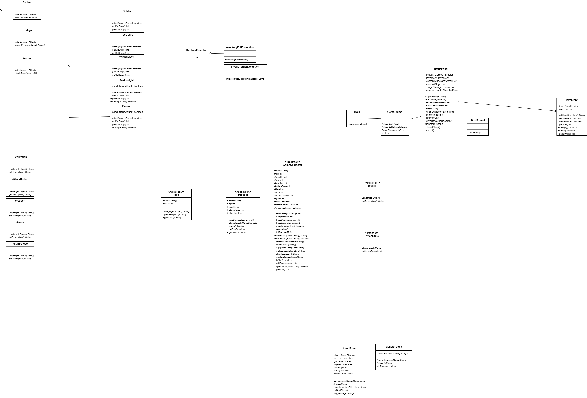
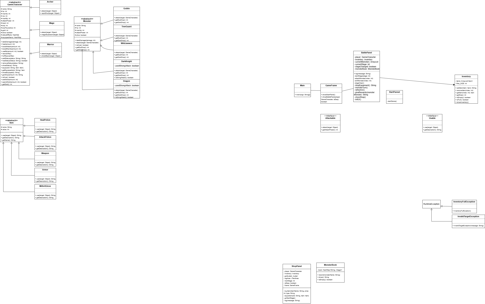
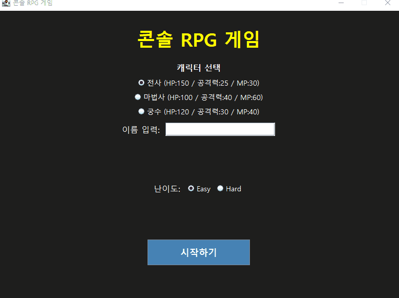
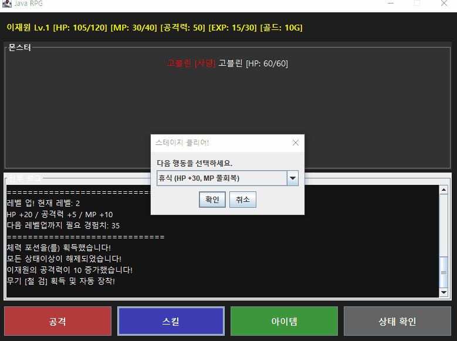
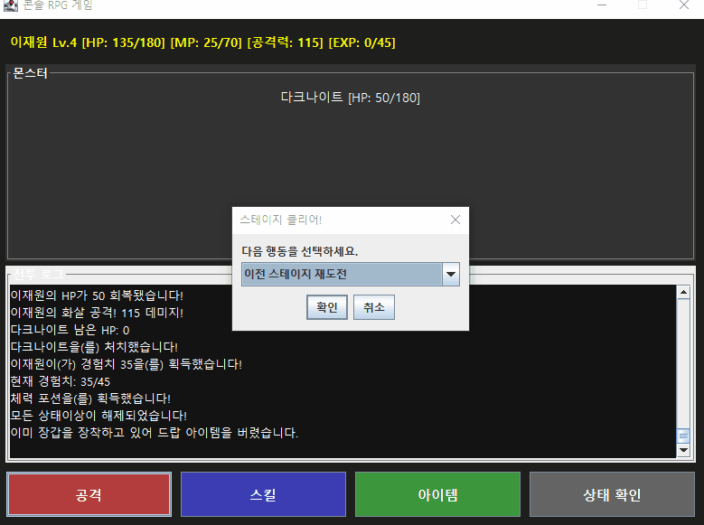
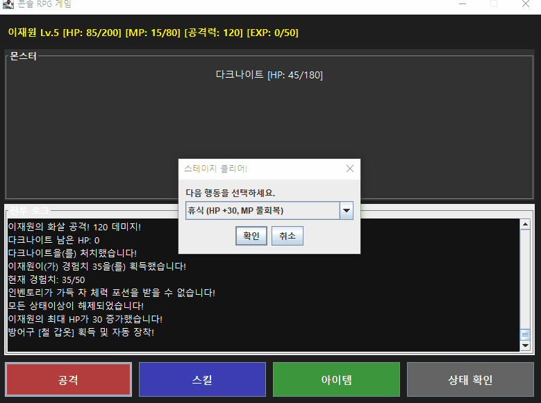

# ⚔️ Java RPG - 턴제 RPG 게임

> Java 100% / Swing GUI 기반 턴제 RPG 미니 프로젝트

---

## 👤 개발자 정보

| 항목 | 내용 |
|------|------|
| 언어 / 기술 | Java 100% (Swing, 컬렉션 프레임워크, 상속, 인터페이스, 예외 처리) |
| 개발 형태 | 개인 프로젝트 |

---

## 📚 프로젝트 개요

**Java RPG**는 Java Swing을 활용한 턴제 RPG 게임입니다.
플레이어는 전사, 마법사, 궁수 중 캐릭터를 선택하고 난이도를 골라 4개의 스테이지를 클리어하는 것이 목표입니다.
전투, 레벨업, 장비 드랍, 스킬 시스템, 골드 및 상점 시스템 등 RPG의 핵심 요소를 Java OOP 개념을 활용해 구현했습니다.

**기획 의도:** Java 수업에서 학습한 상속, 인터페이스, 예외처리, 컬렉션 프레임워크를 실제 프로젝트에 통합적으로 적용하고 Swing을 활용한 GUI 구현까지 경험하는 것을 목표로 했습니다.

---

## 🛠️ 기술 스택

- 언어: Java
- GUI: Swing (JFrame, JPanel, JButton, JTextArea 등)
- 데이터 관리: ArrayList, HashSet, HashMap
- 핵심 개념: 상속(extends), 인터페이스(implements), 예외처리(try-catch), 추상클래스

---

## 🎮 주요 기능

| 번호 | 기능명 | 설명 |
|------|--------|------|
| 1 | 캐릭터 선택 | 전사 / 마법사 / 궁수 중 선택, 각각 고유 스탯과 스킬 보유 |
| 2 | 난이도 선택 | Easy / Hard 선택, 몬스터 공격력에 영향 |
| 3 | 턴제 전투 | 공격 / 스킬 / 아이템 / 상태확인 중 행동 선택 |
| 4 | 고유 스킬 | 전사(방패 가격) / 마법사(마법 폭발) / 궁수(연속 사격), MP 소모 |
| 5 | 캐릭터별 패시브 | 전사(10% 공격 무효화) / 마법사(스킬 사용 시 MP+10) / 궁수(5% 확률 2번 공격) |
| 6 | 레벨 시스템 | 몬스터 처치 시 경험치 획득, 레벨업 시 HP/공격력/MP 증가 |
| 7 | 장비 드랍 | 스테이지 클리어 시 확률적 장비 획득 및 자동 장착 |
| 8 | 인벤토리 | 최대 5칸, 체력 포션 / 공격력 포션 사용 가능 |
| 9 | 상태이상 | 고블린 15% 확률로 독 부여, 스테이지 클리어 시 해제 |
| 10 | 히든 보스 | 스테이지 2에서 30% 확률로 야생의 이재원 등장, 기습 공격 + 미스릴 장갑 드랍 |
| 11 | 보스 패턴 | 드래곤(60% 화염브레스 / 40% 불꽃폭풍) / 다크나이트(60% 암흑검격 / 40% 암흑폭발) |
| 12 | 골드 시스템 | 몬스터 처치 시 골드 획득 |
| 13 | 상점 시스템 | 스테이지 클리어 후 상점 진입, 다양한 아이템 및 장비 구매 가능 |
| 14 | 몬스터 도감 | 처치한 몬스터 및 처치 횟수 기록 |
| 15 | 스테이지 클리어 선택지 | 휴식 / 수련 / 이전 스테이지 재도전 / 상점 |
| 16 | 재도전 시스템 | 사망 시 최종 스탯 확인 후 재도전 여부 선택 가능 |

---

## 🏛️ OOP 설계 핵심 개념

### 상속 기반 다형성

`GameCharacter` 추상클래스를 `Warrior`, `Mage`, `Archer`가 상속받아 `attack()` 메서드를 각자 다르게 구현합니다.
`Monster` 추상클래스를 `Goblin`, `Dragon` 등이 상속받아 고유한 공격 방식을 가집니다.



| 클래스 | 역할 |
|--------|------|
| `GameCharacter` (abstract) | 공통 스탯 및 행동 정의 |
| `Warrior` / `Mage` / `Archer` | 고유 공격 및 스킬 구현 |
| `Monster` (abstract) | 몬스터 공통 구조 정의 |
| `Goblin` / `Dragon` 등 | 고유 공격 패턴 구현 |
| `Item` (abstract) | 아이템 공통 구조 정의 |
| `HealPotion` / `Weapon` 등 | 고유 사용 효과 구현 |

---

### 인터페이스 기반 규칙

`Attackable` 인터페이스로 공격 규칙을 정의하고 `GameCharacter`와 `Monster`가 구현합니다.
`Usable` 인터페이스로 아이템 사용 규칙을 정의하고 모든 아이템이 구현합니다.



| 인터페이스 | 구현 클래스 | 목적 |
|-----------|------------|------|
| `Attackable` | `GameCharacter`, `Monster` | 공격 행동 규칙 강제 |
| `Usable` | `Item` 및 하위 클래스 | 아이템 사용 규칙 강제 |

---

### 상황별 예외처리

`RuntimeException`을 상속받은 커스텀 예외 클래스로 상황별 예외를 처리합니다.



| 예외 클래스 | 발생 상황 |
|------------|----------|
| `InventoryFullException` | 인벤토리 5칸이 꽉 찼을 때 |
| `InvalidTargetException` | 잘못된 입력 또는 잘못된 대상 선택 시 |

---

## 📦 컬렉션 프레임워크 사용 이유

| 컬렉션 | 사용 위치 | 선택 이유 |
|--------|----------|----------|
| `ArrayList<Item>` | Inventory | 순서 유지, 인덱스로 슬롯 접근 필요 |
| `HashSet<String>` | GameCharacter | 상태이상 중복 방지 (독이 두 번 걸리면 안 됨) |
| `HashMap<String, Item>` | GameCharacter | 슬롯 이름(무기/방어구/장갑)으로 장비 관리 |
| `HashMap<String, Integer>` | MonsterBook | 몬스터 이름과 처치 횟수를 키-값으로 관리 |

---

## 🖥️ 실행 화면

### 1. 게임 시작 + 스테이지 1


### 2. 히든 보스 + 스테이지 2~3


### 3. 인벤토리 예외처리


### 4. 보스 클리어


---

## ⚙️ 겪었던 오류 및 해결 과정

### 1. GUI 전환 시 System.out.println() 출력 문제

**문제:** 콘솔 기반에서 GUI로 전환 시 `System.out.println()`으로 출력하던 내용이 UI 로그창에 표시되지 않음

**원인:** Swing UI는 별도 스레드에서 동작하기 때문에 콘솔 출력과 GUI 출력이 분리되어 있음

**해결:** `System.out.println()` 전부 제거하고 메서드가 `String`을 `return`하도록 수정 후 `BattlePanel`의 `log()`로 출력하는 구조로 변경

```java
// 수정 전
public void use(Object target) {
    character.heal(value);
    System.out.println(character.getName() + "의 HP가 " + value + " 회복됐습니다!");
}

// 수정 후
public String use(Object target) {
    character.heal(value);
    return character.getName() + "의 HP가 " + value + " 회복됐습니다!";
}
```

### 2. 스테이지 전환 시 새 스테이지 몬스터가 먼저 공격하는 문제

**문제:** 몬스터를 처치하고 스테이지가 넘어갈 때 다음 스테이지 몬스터가 먼저 공격하는 현상 발생

**원인:** `attackMonster()` → `checkMonsterDead()` → `stageClear()` → `startStage()` 순서로 새 스테이지가 시작된 후 `attackMonster()`로 돌아와서 `monsterTurn()`이 실행되는 구조

**해결:** `stageChanged` 플래그를 추가해 스테이지가 변경됐을 때 `monsterTurn()`이 실행되지 않도록 처리

```java
private boolean stageChanged = false;

private void startStage(int stage) {
    stageChanged = true;
    ...
}

private void attackMonster(int index) {
    stageChanged = false;
    ...
    checkMonsterDead(monster);
    if (!stageChanged && !allMonstersDead() && player.isAlive()) {
        monsterTurn();
    }
}
```

### 3. 상점에서 다음 스테이지로 이동 시 스테이지 1로 초기화되는 문제

**문제:** 상점에서 다음 스테이지 버튼 클릭 시 스테이지 1부터 다시 시작되는 현상 발생

**원인:** `BattlePanel`이 새로 생성될 때 항상 `startStage(1)`을 호출하는 구조

**해결:** 상점에서 돌아올 때 사용하는 별도 생성자를 추가해 현재 스테이지 번호와 기존 인벤토리를 그대로 전달하는 구조로 변경

```java
// 상점에서 돌아올 때 쓰는 생성자
public BattlePanel(GameFrame frame, GameCharacter player,
                   boolean isEasy, Inventory inventory, int startStage) {
    this.inventory = inventory; // 기존 인벤토리 유지
    ...
    startStage(startStage); // 지정된 스테이지부터 시작
}
```

---

## 🚀 실행 방법

1. 이 저장소를 Clone 받습니다.
2. Eclipse IDE에서 `File → Import → General → Existing Projects into Workspace` 선택
3. Clone 받은 `Java_RPG` 폴더를 선택하고 Finish
4. `src/main/Main.java` 파일을 찾아 `Run As → Java Application`으로 실행

---

## 🔮 추후 추가 기능 예상

1. **세이브 기능** - 게임 진행 저장/불러오기
2. **스테이지 추가** - 더 다양한 몬스터와 보스
3. **장비 강화 시스템** - 골드로 장비 강화 가능
4. **멀티플레이** - 소켓 통신 기반 협동 플레이

---

## 🖼️ 이미지 출처

- 시작 화면 배경 이미지: [Unsplash](https://unsplash.com) (무료 사용 라이선스)
